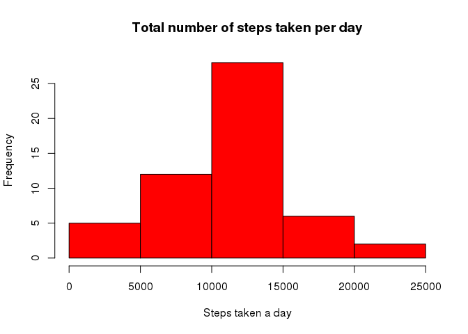
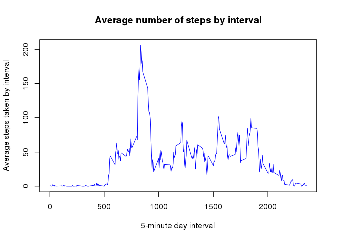
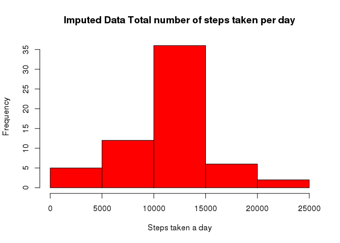
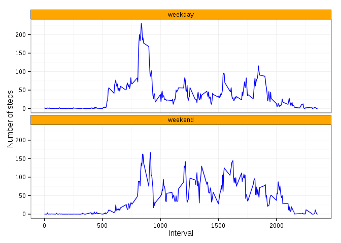

# PA1_template
DataScienceGB  
11/06/2015  

##Loading and preprocessing the data


```r
library(sqldf)
```

```
## Loading required package: gsubfn
## Loading required package: proto
## Loading required package: RSQLite
## Loading required package: DBI
```
We'll be using sqldf package to perfom data agregation and selection
Starting by reading data into a DataFrame using standard read.csv funciton
activity.zip file was previously inflated.

```r
#Read Activity
actdf=read.csv("./activity.csv",stringsAsFactors=F)

#summarize steps by day
act_grp=sqldf("select date, sum(steps) as Steps from actdf where steps!='NA' group by date")
```

```
## Loading required package: tcltk
```
##What is mean total number of steps taken per day?

For this part of the assignment, you can ignore the missing values in the dataset.

1. Make a histogram of the total number of steps taken each day

2. Calculate and report the mean and median total number of steps taken per day


```r
#Create Steps histogram
hist(act_grp$Steps,col="red",main="Total number of steps taken per day", xlab="Steps taken a day")
```

 

Calculate mean and median values


```r
#Calculate Mean and Median steps taken per day
mean(act_grp$Steps)
```

```
## [1] 10766.19
```

```r
median(act_grp$Steps)
```

```
## [1] 10765
```
##What is the average daily activity pattern?

1. Make a time series plot (i.e. type = "l") of the 5-minute interval (x-axis) and the average number of steps taken, averaged across all days (y-axis)


First calculate mean values for each interval:


```r
#average days by interval
act_avg=sqldf("select  interval,avg(steps) as Steps from actdf where steps!='NA' group by interval")
```
Now plot the timeline

```r
#Create  create timeline
plot(act_avg$interval,act_avg$Steps,type="l",col="blue",main="Average number of steps by interval", ylab="Average steps taken by interval",xlab="5-minute day interval")
```

 

2. Which 5-minute interval, on average across all the days in the dataset, contains the maximum number of steps?

Obtain the maximum value and interval number


```r
#Calculate maximum 5-minute interval across all days
#Order by will show maximum value and interval as the first row, and limit 1 claus will only show the first row
sqldf("select interval, max(Steps) from act_avg group by interval order by 2 desc limit 1")
```

```
##   interval max(Steps)
## 1      835   206.1698
```

## Imputing missing values

Note that there are a number of days/intervals where there are missing values (coded as NA). The presence of missing days may introduce bias into some calculations or summaries of the data

1. Calculate and report the total number of missing values in the dataset (i.e. the total number of rows with NAs)


```r
table(is.na(actdf$steps))
```

```
## 
## FALSE  TRUE 
## 15264  2304
```
In last table, "TRUE" column shows the number of missing values (NA's) for the steps measure

2. Devise a strategy for filling in all of the missing values in the dataset. The strategy does not need to be sophisticated. For example, you could use the mean/median for that day, or the mean for that 5-minute interval, etc

We'll use the previouslly calculated average value of each interval to impute those missing step's measures

3. Create a new dataset that is equal to the original dataset but with the missing data filled in


```r
#create a new data set as a copy of the original, to fill missing values

actdf_imputed=actdf

#Select those rows having na values with is.na and assign them the averege value of its interval
actdf_imputed$steps[is.na(actdf$steps)]=act_avg$Steps
```
4. Make a histogram of the total number of steps taken each day and Calculate and report the mean and median total number of steps taken per day. 

```r
#Summarize steps from the new imputed data set
act_grp2=sqldf("select date, sum(steps) as Steps from actdf_imputed group by date")

#Create Steps histogram
hist(act_grp2$Steps,col="red",main="Imputed Data Total number of steps taken per day", xlab="Steps taken a day")
```

 

Do these values differ from the estimates from the first part of the assignment? 
What is the impact of imputing missing data on the estimates of the total daily number of steps?


```r
print(c("Original set: ",mean(act_grp$Steps),median(act_grp$Steps)))
```

```
## [1] "Original set: "   "10766.1886792453" "10765"
```

```r
print(c("Imputed data set: ",mean(act_grp2$Steps),median(act_grp2$Steps)))      
```

```
## [1] "Imputed data set: " "10766.1886792453"   "10766.1886792453"
```
As we can see, there were no mayor differences usint the imputed data set values.


##Are there differences in activity patterns between weekdays and weekends?

For this part the weekdays() function may be of some help here. Use the dataset with the filled-in missing values for this part.

1. Create a new factor variable in the dataset with two levels -- "weekday" and "weekend" indicating whether a given date is a weekday or weekend day.


```r
#Add a new column indicating if the date is a weekday or weekend  
#0,6 means sunday and saturday, therefore is_weekend=TRUE
actdf_imputed$is_weekend=(strftime(as.Date(actdf_imputed$date),'%w') %in% c(0,6))
#average steps by day
#average steps by day
act_week=sqldf("select interval,(case is_weekend
                              when 1 then 'weekend'
                              else     'weekday'
                             end) as week_fact, avg(steps) as Steps 
                 from actdf_imputed 
                 group by interval,is_weekend"
               )

#converts new column to a factor
act_week$week_fact=as.factor(act_week$week_fact)
```


2. Make a panel plot containing a time series plot (i.e. type = "l") of the 5-minute interval (x-axis) and the average number of steps taken, averaged across all weekday days or weekend days (y-axis). 


```r
#load ggplot2
library(ggplot2)

#Create  weekday vs weekend comparission chart
p<-ggplot(act_week,aes(x=interval,y=Steps))+
            geom_line(color="blue",)+
            facet_wrap(~ week_fact,ncol=1)+          
            theme_bw(base_family="Arial")+
            labs(y="Number of steps",x="Interval")+
            theme(strip.background = element_rect(colour = "black", fill = "orange"))

print(p)
```

 

During week days there is more activity in the morning, however weekends show more activity through mid day.
